# 数据模型 ER 图

本文档定义 StudyPilot 系统的完整实体关系模型，基于 `docs/architecture_design.md` §6 数据库设计。

---

## 实体关系图（Mermaid ERD）

```mermaid
erDiagram

    %% ============================================================
    %% 用户与学生档案
    %% ============================================================

    users {
        int id PK
        varchar phone UK "手机号，唯一"
        varchar nickname
        varchar avatar_url
        varchar role "student | parent | admin"
        timestamptz created_at
        timestamptz updated_at
    }

    student_profiles {
        int id PK
        int user_id FK "→ users.id，唯一"
        varchar grade "高一 | 高二 | 高三"
        varchar textbook_version
        int class_rank
        int grade_rank
        jsonb subject_combination "选科组合列表"
        jsonb upcoming_exams "近期考试节点"
        jsonb current_progress "当前学习进度"
        boolean onboarding_completed "冷启动标志"
        jsonb onboarding_data "入学问卷原始数据"
        timestamptz created_at
        timestamptz updated_at
    }

    exam_records {
        int id PK
        int student_id FK "→ student_profiles.id"
        varchar exam_type "月考 | 期中 | 期末 | 周测"
        date exam_date
        int subject_id FK "→ subjects.id"
        decimal score
        decimal full_score
        int class_rank
        int grade_rank
        timestamptz created_at
        varchar created_by "student | parent | admin"
    }

    %% ============================================================
    %% 学科与知识树
    %% ============================================================

    subjects {
        int id PK
        varchar name UK "数学 | 语文 | ..."
        varchar code UK "math | chinese | ..."
        int display_order
        boolean is_active
    }

    knowledge_tree {
        int id PK
        int subject_id FK "→ subjects.id"
        int parent_id FK "→ knowledge_tree.id，自引用"
        varchar name "知识点名称"
        varchar code "知识点编码"
        int level "1-章 | 2-节 | 3-点"
        text description
        jsonb textbook_versions "适用教材版本"
        decimal importance_score "0.0-1.0，考纲+频次计算"
        int exam_frequency "近5年高考出现次数"
        int last_exam_year "最近出现年份"
        varchar syllabus_level "了解 | 理解 | 掌握"
        timestamptz created_at
    }

    student_knowledge_status {
        int id PK
        int student_id FK "→ student_profiles.id"
        int knowledge_point_id FK "→ knowledge_tree.id"
        varchar status "未观察|初步接触|需要巩固|基本掌握|反复失误"
        varchar last_update_reason "镜像 knowledge_update_logs.trigger_type 值（quiz_correct|quiz_wrong|recall_success|recall_fail|manual）"
        timestamptz last_updated_at
        boolean is_manual_corrected
    }

    knowledge_update_logs {
        bigint id PK
        int student_id FK "→ student_profiles.id"
        int knowledge_point_id FK "→ knowledge_tree.id"
        varchar previous_status
        varchar new_status
        varchar trigger_type "quiz_correct|quiz_wrong|recall_success|recall_fail|manual"
        jsonb trigger_detail "对应 structured_summary 单条记录"
        timestamptz created_at
    }

    %% ============================================================
    %% 学习计划与任务
    %% ============================================================

    daily_plans {
        int id PK
        int student_id FK "→ student_profiles.id"
        boolean is_deleted "软删除标记"
        date plan_date
        varchar learning_mode "workday_follow | weekend_review"
        varchar system_recommended_mode
        int available_minutes
        varchar source "upload_corrected|history_inferred|manual_adjusted|generic_fallback"
        boolean is_history_inferred
        jsonb recommended_subjects "推荐学科+原因标签"
        jsonb plan_content "完整计划 JSON"
        varchar status "generated | in_progress | completed"
        timestamptz created_at
    }

    plan_tasks {
        int id PK
        int plan_id FK "→ daily_plans.id"
        int subject_id FK "→ subjects.id"
        varchar task_type "lecture|practice|error_review|consolidation"
        jsonb task_content "任务详情"
        int sequence "任务顺序"
        int estimated_minutes "Planning Agent 生成时预计时长"
        varchar status "pending|entered|executed|completed"
        timestamptz started_at
        timestamptz completed_at
        int duration_minutes "实际用时"
    }

    %% ============================================================
    %% 学习材料上传与错题本
    %% ============================================================

    study_uploads {
        int id PK
        int student_id FK "→ student_profiles.id"
        boolean is_deleted "软删除标记"
        varchar upload_type "note|homework|test|handout|score"
        varchar file_hash "SHA256 文件哈希，服务端写入后计算（MVP 不实现秒传，仅用于去重存储）"
        varchar original_url "OSS 原始文件 URL"
        varchar thumbnail_url
        jsonb ocr_result "OCR 结构化结果"
        jsonb extracted_questions "提取的题目列表"
        int subject_id FK "→ subjects.id，可空"
        jsonb knowledge_points "关联知识点 ID 列表"
        varchar ocr_status "pending|processing|completed|failed"
        text ocr_error
        boolean is_manual_corrected
        timestamptz created_at
    }

    error_book {
        int id PK
        int student_id FK "→ student_profiles.id"
        boolean is_deleted "软删除标记"
        int subject_id FK "→ subjects.id"
        jsonb question_content "题目内容（含 LaTeX）"
        varchar question_image_url "原题图片"
        jsonb knowledge_points "关联知识点"
        varchar error_type "calc_error|concept_unclear|careless|unknown"
        varchar entry_reason "wrong|not_know|repeated_wrong"
        varchar content_hash "SHA256 去重键，UK(student_id,content_hash)"
        boolean is_explained
        boolean is_recalled
        timestamptz last_recall_at
        varchar last_recall_result "success | fail"
        int recall_count
        int source_upload_id FK "→ study_uploads.id，可空"
        timestamptz created_at
    }

    %% ============================================================
    %% 答疑会话
    %% ============================================================

    qa_sessions {
        int id PK
        int student_id FK "→ student_profiles.id"
        date session_date
        int task_id FK "→ plan_tasks.id，可空"
        int subject_id FK "→ subjects.id，可空"
        varchar status "active | closed"
        jsonb structured_summary "Assessment Agent 输出（§4.5 格式）"
        timestamptz created_at
        timestamptz closed_at
    }

    qa_messages {
        int id PK
        int session_id FK "→ qa_sessions.id"
        varchar role "user | assistant"
        text content
        jsonb attachments "附件（图片等）"
        varchar intent "upload_question|ask|follow_up|chat"
        int related_question_id FK "→ error_book.id，可空"
        jsonb knowledge_points "关联知识点"
        varchar tutoring_strategy "hint|step_by_step|formula|full_solution"
        timestamptz created_at
    }

    %% ============================================================
    %% 学科风险与周报
    %% ============================================================

    subject_risk_states {
        int id PK
        int student_id FK "→ student_profiles.id"
        int subject_id FK "→ subjects.id"
        varchar risk_level "稳定|轻度风险|中度风险|高风险"
        varchar effective_week "2026-W12 格式"
        jsonb calculation_detail "计算明细"
        timestamptz created_at
    }

    weekly_reports {
        int id PK
        int student_id FK "→ student_profiles.id"
        varchar report_week "2026-W12 格式，唯一(student_id,week)"
        int usage_days
        int total_minutes
        jsonb student_view_content "学生视角完整内容"
        jsonb parent_view_content "家长视角内容（无敏感字段）"
        jsonb share_summary "分享摘要（脱敏）"
        varchar share_token UK "分享 Token"
        timestamptz share_expires_at
        timestamptz created_at
    }

    %% ============================================================
    %% 系统运维
    %% ============================================================

    model_call_logs {
        bigint id PK
        uuid request_id
        int student_id FK "→ student_profiles.id，可空"
        varchar agent_name "routing|extraction|planning|tutoring|assessment"
        varchar mode "normal | best"
        varchar provider
        varchar model
        int latency_ms
        int input_tokens
        int output_tokens
        boolean is_fallback
        boolean success
        text error_message
        decimal estimated_cost "元"
        timestamptz created_at
    }

    manual_corrections {
        int id PK
        varchar target_type "ocr|knowledge|plan|qa"
        int target_id "目标记录 ID"
        jsonb original_content
        jsonb corrected_content
        text correction_reason
        int corrected_by FK "→ users.id"
        timestamptz created_at
    }

    %% ============================================================
    %% 关联关系
    %% ============================================================

    users ||--|| student_profiles : "一个用户一个学生档案"
    student_profiles ||--o{ exam_records : "有多条考试记录"
    student_profiles ||--o{ daily_plans : "每天一份计划"
    student_profiles ||--o{ study_uploads : "上传多个材料"
    student_profiles ||--o{ error_book : "错题本"
    student_profiles ||--o{ qa_sessions : "多个答疑会话"
    student_profiles ||--o{ student_knowledge_status : "知识点状态"
    student_profiles ||--o{ knowledge_update_logs : "状态变更日志"
    student_profiles ||--o{ subject_risk_states : "学科风险（周维度）"
    student_profiles ||--o{ weekly_reports : "每周一份周报"

    subjects ||--o{ exam_records : "学科→考试记录"
    subjects ||--o{ knowledge_tree : "学科→知识树"
    subjects ||--o{ plan_tasks : "学科→任务"
    subjects ||--o{ study_uploads : "学科→上传（可空）"
    subjects ||--o{ error_book : "学科→错题"
    subjects ||--o{ qa_sessions : "学科→答疑（可空）"
    subjects ||--o{ subject_risk_states : "学科→风险状态"

    knowledge_tree ||--o{ knowledge_tree : "父节点→子节点（自引用）"
    knowledge_tree ||--o{ student_knowledge_status : "知识点→学生掌握状态"
    knowledge_tree ||--o{ knowledge_update_logs : "知识点→状态变更日志"

    daily_plans ||--o{ plan_tasks : "计划→任务列表"
    plan_tasks ||--o{ qa_sessions : "任务→关联答疑（可空）"

    study_uploads ||--o{ error_book : "上传→来源错题（可空）"

    qa_sessions ||--o{ qa_messages : "会话→消息列表"
    qa_messages }o--o| error_book : "消息→关联错题（可空）"

    users ||--o{ manual_corrections : "管理员→纠偏记录"
```



---

## 表结构速查

### 核心实体概览

| 表名 | 记录量级（MVP，5用户）| 主要用途 |
|------|---------------------|---------|
| `users` | ~10 | 账号管理 |
| `student_profiles` | ~5 | 学生档案与冷启动状态 |
| `exam_records` | ~100/年 | 月考/期中等成绩记录 |
| `subjects` | 9（固定）| 学科字典 |
| `knowledge_tree` | ~2000（5科）| 知识点图谱，静态数据 |
| `student_knowledge_status` | ~10000（5生×2000点）| 知识点掌握状态，高频写 |
| `knowledge_update_logs` | ~50000/年 | 状态变更事件流，只增 |
| `daily_plans` | ~1825/年（5生×365天）| 每日计划，周期性查询 |
| `plan_tasks` | ~5000/年 | 任务列表，随计划增长 |
| `study_uploads` | ~2000/年 | 材料上传，含 OSS 引用 |
| `error_book` | ~1000/年 | 错题本，去重写入 |
| `qa_sessions` | ~1500/年 | 答疑会话 |
| `qa_messages` | ~15000/年 | 消息明细，流量最大 |
| `subject_risk_states` | ~2340/年（5生×9科×52周）| 学科风险，周维度聚合 |
| `weekly_reports` | ~260/年（5生×52周）| 周报快照 |
| `model_call_logs` | ~50000/年 | 模型调用审计，只增 |
| `manual_corrections` | ~100/年 | 人工纠偏，低频 |

---

## 关键字段说明

### `student_profiles` — 冷启动相关字段

| 字段 | 类型 | 用途 |
|------|------|------|
| `onboarding_completed` | BOOLEAN | Planning Agent 在此为 `false` 时拒绝生成个性化计划 |
| `onboarding_data` | JSONB | 原始问卷数据，保留供追溯和重新计算 |

### `knowledge_tree` — 重要性评分字段

| 字段 | 类型 | 计算方式 |
|------|------|---------|
| `importance_score` | DECIMAL(5,4) | `freq×0.4 + score_weight×0.4 + syllabus_weight×0.2`，归一化到 0-1 |
| `exam_frequency` | INTEGER | 近 5 年（2020-2024）上海高考出现次数 |
| `syllabus_level` | VARCHAR | 了解(0.3) / 理解(0.6) / 掌握(1.0)，参与加权 |

### `student_knowledge_status.last_update_reason` — 与 `trigger_type` 的关系

`last_update_reason` 直接取 `knowledge_update_logs.trigger_type` 的值（枚举：`quiz_correct` / `quiz_wrong` / `recall_success` / `recall_fail` / `manual`）。每次写入知识点状态时，同步更新此字段，避免前端查询日志表。

---

### `student_knowledge_status` — 状态值域

| 状态 | 含义 | 升级条件 |
|------|------|---------|
| `未观察` | 未接触 | 任意触发 → `初步接触` |
| `初步接触` | 首次接触，未验证 | 答对（含提示）→ `需要巩固` |
| `需要巩固` | 有接触，尚不稳定 | 不同会话答对 ≥2 次 → `基本掌握` |
| `基本掌握` | 相对稳定 | 同知识点累计错误 ≥2 次 → `反复失误` |
| `反复失误` | 反复出错，高风险 | 人工纠偏 或 召回成功 → `需要巩固` |

### `error_book` — 去重机制

```
content_hash = SHA256(question_text + sorted(knowledge_point_ids))
唯一索引: CREATE UNIQUE INDEX ON error_book(student_id, content_hash)
          WHERE content_hash IS NOT NULL
```

同一学生同一题（相同知识点组合）只保留一条记录，`recall_count` 累加。

### `qa_sessions.structured_summary` — Assessment Agent 输出

```json
{
  "session_id": 123,
  "assessed_at": "2026-03-18T21:30:00+08:00",
  "knowledge_point_updates": [
    {
      "knowledge_point_id": 42,
      "knowledge_point_name": "函数的定义域",
      "previous_status": "初步接触",
      "new_status": "需要巩固",
      "reason": "经提示后答对",
      "confidence": 0.85
    }
  ],
  "session_summary": {
    "total_questions": 3,
    "correct_first_try": 1,
    "correct_with_hint": 1,
    "incorrect": 1,
    "dominant_error_type": "概念不清"
  },
  "suggested_followup": "建议明日复习函数定义域与值域的区分"
}
```

### `daily_plans.source` — 计划来源类型

| 值 | 触发条件 |
|----|---------|
| `upload_corrected` | 当日有新上传，基于最新内容生成 |
| `history_inferred` | 无新上传，基于历史学情推断 |
| `manual_adjusted` | 管理员人工调整 |
| `generic_fallback` | 连续 7 天无上传，降级为通用补漏计划 |

### `subject_risk_states.risk_level` — 风险等级计算

周日晚 Celery Beat 任务 `aggregate_weekly_subject_risk()` 计算：

| 风险等级 | 典型触发条件 |
|---------|------------|
| `稳定` | 错误率 <20%，召回成功率 >80% |
| `轻度风险` | 错误率 20-40% 或 成绩轻微下滑 |
| `中度风险` | 错误率 40-60% 或 连续 2 周下滑 |
| `高风险` | 错误率 >60% 或 `反复失误` 知识点 ≥3 个 |

---

## 索引策略

### 高频查询索引

```sql
-- 今日计划查询（工作台首屏）
CREATE INDEX idx_daily_plans_student_date ON daily_plans(student_id, plan_date DESC);

-- 错题列表按学生+学科查询
CREATE INDEX idx_error_book_student ON error_book(student_id);
CREATE INDEX idx_error_book_subject ON error_book(subject_id);

-- 错题召回队列（未召回题目按时间排序）
CREATE INDEX idx_error_book_recall ON error_book(is_recalled, last_recall_at);

-- 错题去重（应用层写入前查重）
CREATE UNIQUE INDEX idx_error_book_dedup ON error_book(student_id, content_hash)
    WHERE content_hash IS NOT NULL;

-- 答疑会话列表
CREATE INDEX idx_qa_sessions_student ON qa_sessions(student_id, created_at DESC);

-- 知识点状态按学生查询
CREATE INDEX idx_student_knowledge_student ON student_knowledge_status(student_id);
CREATE INDEX idx_student_knowledge_status ON student_knowledge_status(status);

-- 学科风险周报按学生查询
CREATE INDEX idx_risk_states_student ON subject_risk_states(student_id);

-- 知识点状态变更日志（时序查询）
CREATE INDEX idx_knowledge_logs_student ON knowledge_update_logs(student_id, created_at DESC);

-- 模型调用日志（监控报表）
CREATE INDEX idx_model_logs_created ON model_call_logs(created_at DESC);
CREATE INDEX idx_model_logs_agent ON model_call_logs(agent_name, created_at DESC);

-- OCR 失败队列（管理端监控）
CREATE INDEX idx_study_uploads_ocr_status ON study_uploads(ocr_status);

-- 人工纠偏按类型查询
CREATE INDEX idx_corrections_type ON manual_corrections(target_type, created_at DESC);
```

---

## CQRS 读写模型分离说明

系统采用轻度 CQRS 模式，以适应以下读写特性差异：

### 写入路径（Command Model）

| 场景 | 写入表 | 特点 |
|------|--------|------|
| 答疑消息 | `qa_messages` | 高频，单条插入 |
| 知识点状态更新 | `student_knowledge_status` | 幂等 UPSERT |
| 状态变更日志 | `knowledge_update_logs` | 只增，事件溯源 |
| 任务状态变更 | `plan_tasks` | 状态机单向推进 |
| 模型调用记录 | `model_call_logs` | 只增，异步写入 |

### 读取路径（Query Model）

| 场景 | 主要读取 | 优化方式 |
|------|---------|---------|
| 工作台首屏 | `daily_plans` + `plan_tasks` | student_id+date 联合索引，走缓存 |
| 周报生成 | 多表聚合，每周一次 | 预计算后写入 `weekly_reports` 快照 |
| 家长视图 | `weekly_reports.parent_view_content` | 直接读 JSONB 快照，无需二次聚合 |
| 管理监控 | `model_call_logs` 聚合 | 按 created_at DESC 排序，分页 |
| 学情快照 | `student_knowledge_status` 批量读 | 覆盖索引（student_id, status） |

### 学情快照（Planning Agent 输入）

Planning Agent 每次生成计划时加载"学情快照"，为避免实时聚合多表，周维度快照预写入 `weekly_reports.student_view_content`，实时增量通过 `student_knowledge_status` 补充：

```
学情快照 = weekly_reports (最新一份) + student_knowledge_status (实时状态)
```

---

## 数据流向总览

```
用户上传
    │
    ▼
study_uploads ──OCR──► error_book (去重写入)
    │                       │
    │                 knowledge_points (JSONB)
    │
    ▼
Celery (weekly)
    │
    ▼
subject_risk_states ──► weekly_reports (快照)
    ▲
    │
knowledge_update_logs ──► student_knowledge_status
    ▲
    │
qa_sessions.structured_summary (Assessment Agent 输出)
    ▲
    │
qa_messages (答疑消息流)
    ▲
    │
用户答疑
```
